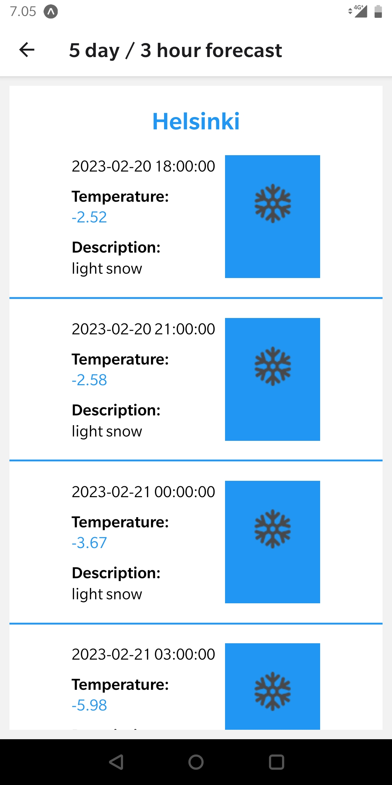

# Second exercise to be graded in React-Native course, I chose to do weather app.

#### If you want to run this application, get yourself an API Key from https://openweathermap.org/ and insert it into Weather.js. Weather.js can be found inside "screens" folder.
 

### In this application you are able to choose 3 locations to view weather by clicking the name of the city. Or simply just by a search with a city name. These 3 cities can be changed via the change button and are saved into your phones memory.
 

 &nbsp; &nbsp; &nbsp;

 
 
5 days forecast is displayed in every 3 hours. 
 
